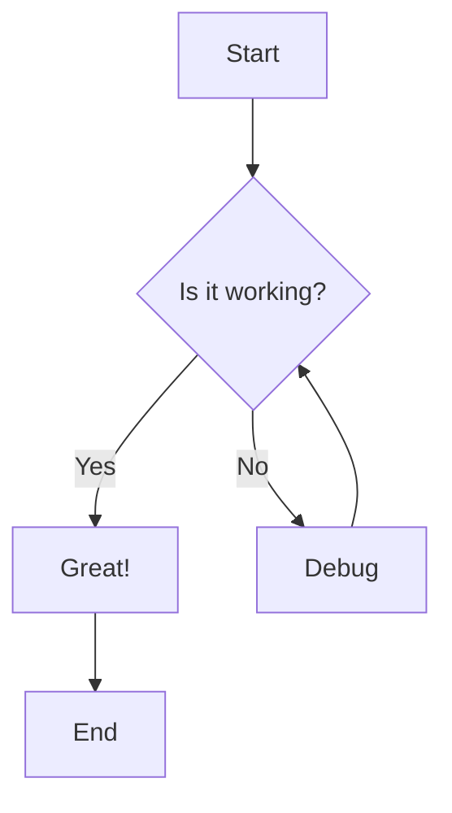
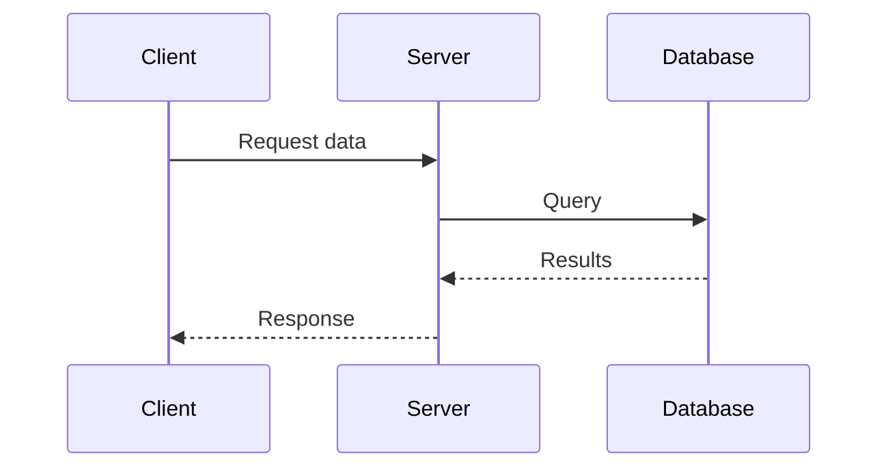
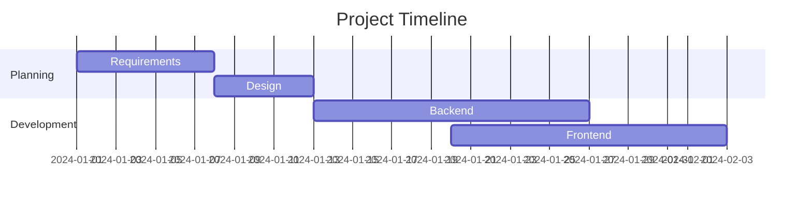

# Markdown syntax guide 🔥🔥🔥🔥

> You are using [solid-markdown-wasm (github)](https://github.com/zeon256/solid-markdown-wasm). 

## Blockquotes

> [!NOTE]
> This is an informational blockquote. $x+3$

> [!TIP]
> This is a tip blockquote.

> [!IMPORTANT]
> This is an important blockquote.

> [!WARNING]
> This is a warning blockquote.

> [!CAUTION]
> This is a caution blockquote.


> Markdown is a lightweight markup language with plain-text-formatting syntax, created in 2004 by John Gruber with Aaron Swartz.
>
>> Markdown is often used to format readme files, for writing messages in online discussion forums, and to create rich text using a plain text editor.

## Mermaid Diagrams

### Flow Chart


### Sequence Diagram


### Gantt Chart


## Blocks of code

```javascript
let message = 'Hello world';
alert(message);
```

```cpp
#include <iostream>
#include <vector>
 
auto main() -> int {
    std::vector<int> v = {8, 4, 5, 9};
 
    v.emplace_back(6);
    v.emplace_back(9);
 
    v[2] = -1;
 
    for (int n : v)
        std::cout << n << ' ';
    std::cout << '\n';
}
```

## Headers

# This is a Heading h1
## This is a Heading h2
###### This is a Heading h6

## Emphasis

*This text will be italic*  
_This will also be italic_

**This text will be bold**  
__This will also be bold__

_You **can** combine them_

## Lists

### Unordered

* Item 1
* Item 2
* Item 2a
* Item 2b
    * Item 3a
    * Item 3b

### Ordered

1. Item 1
2. Item 2
3. Item 3
    1. Item 3a
    2. Item 3b

### Tasklist
- [x] Wake up
- [ ] Drink water
- [ ] Make lunch

## Images


## Links

You are using [solid-markdown-wasm](https://github.com/zeon256/solid-markdown-wasm).

## Tables

| Left columns  | Right columns |
| ------------- |:-------------:|
| left foo      | right foo     |
| left bar      | right bar     |
| left baz      | right baz     |

## Iframes

<iframe width="560" height="315" src="https://www.youtube.com/embed/7chBqP8W60M?si=E6RrZfaeuMmZtosb" title="YouTube video player" frameborder="0" allow="accelerometer; autoplay; clipboard-write; encrypted-media; gyroscope; picture-in-picture; web-share" referrerpolicy="strict-origin-when-cross-origin" allowfullscreen></iframe>

## Inline code

This web site is using `solid-markdown-wasm`.

# 🔬 Typst Math in Markdown!

## 1. Complex Multi-line Equations

### Maxwell's Equations in Differential Form
```math
nabla dot bold(E) &= rho / epsilon_0 \
nabla dot bold(B) &= 0 \
nabla times bold(E) &= -(diff bold(B)) / (diff t) \
nabla times bold(B) &= mu_0 bold(J) + mu_0 epsilon_0 (diff bold(E)) / (diff t)
```

### Schrödinger Equation with Hamiltonian
```math
i planck.reduce (diff Psi(bold(r), t)) / (diff t) = hat(H) Psi(bold(r), t) = [-(planck.reduce^2) / (2m) nabla^2 + V(bold(r), t)] Psi(bold(r), t)
```
